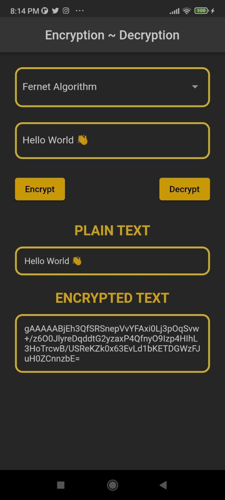
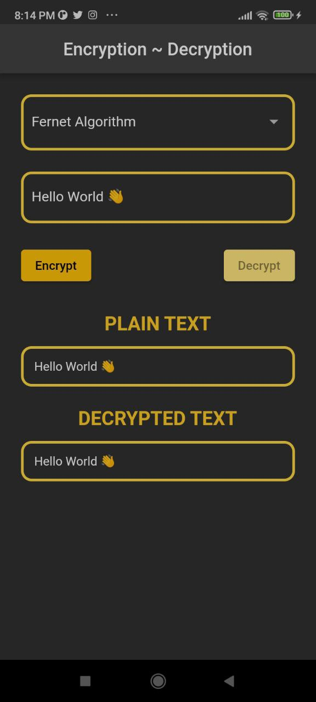
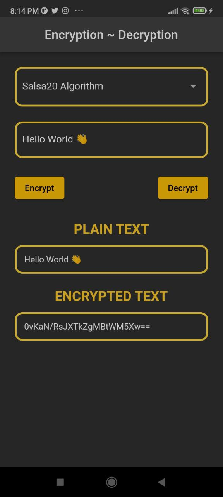
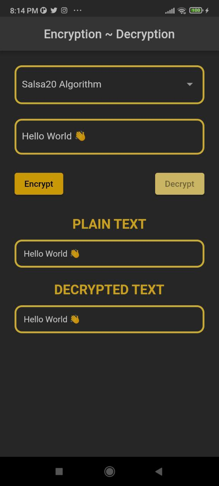

# Encryption Decryption

> Symmetric Encryption
- AES Algorithm
- FERNET Algorithm
- SALSA20 Algorithm

| Empty View | Input View |
|----------------|:----------------:|
|  |  |

| AES Encryption | AES Decryption |
|----------------|:----------------:|
|  |  |

| Fernet Encryption | Fernet Decryption |
|----------------|:----------------:|
|  |  |

| Salsa20 Encryption | Salsa20 Decryption |
|----------------|:----------------:|
|  |  |

